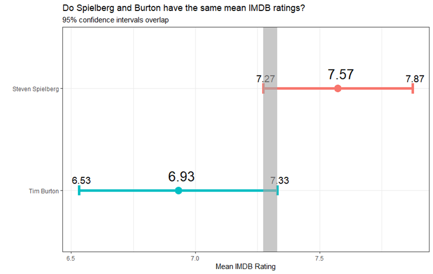

```{r, setup, echo=FALSE}
knitr::opts_chunk$set(
  message = FALSE, 
  warning = FALSE, 
  tidy=FALSE,     # display code as typed
  size="small")   # slightly smaller font for code
options(digits = 3)

# default figure size
knitr::opts_chunk$set(
  fig.width=6.75, 
  fig.height=6.75,
  fig.align = "center"
)
```


```{r load-libraries, echo=FALSE}
library(tidyverse)  # Load ggplot2, dplyr, and all the other tidyverse packages
library(mosaic)
library(ggthemes)
library(GGally)
library(readxl)
library(here)
library(skimr)
library(janitor)
library(broom)
library(tidyquant)
library(infer)
library(openintro)
library(scales)
```


```{r directors, echo=FALSE, include = FALSE, out.width="90%"}

```

This project was realized in collaboration with my study group at London Business School. We exercised our R skills by looking at the relative ratings of the movis from two famous directors. 

A couple weeks ago, we analyzed some data on IMBD ratings. Today, we will explore if there is a clear difference in the ratings received between Tim Burton and Steven Spielberg.

**Our Null Hypothesis: The true difference in means is equal to 0.**

**Alternative hypothesis: The true difference in means is not equal to 0.**


To test this hypothesis, we will use both the `t.test` command and the `infer` package to simulate from a null distribution, where you assume zero difference between the two.

```{r load-movies-data, include = FALSE}
movies <- read_csv(here::here("data", "movies.csv"))
glimpse(movies)
```
```{r}

# Now, we want to select the date that we will use which is the rating and the directors
IMBD <- movies %>% 
  select(rating, director) %>% 
  
  # We also filtered by the two directors in question
  filter(director %in% c("Tim Burton", "Steven Spielberg")) %>% 

  # In order to compare both directors, we group by this variable
  group_by(director) %>% 
  
  # To calculate the necessary information to run a hypothesis test we use summarise
  summarise (
         
          # General Statistics
          mean_rating = 
            mean(rating, na.rm = TRUE),
          sd_rating = 
            sd(rating, na.rm=TRUE),
          count = n(),
         
          # CI Statistics
           se_rating = 
            sd_rating/sqrt(count),
          t_critical = 
            qt(0.975, count-1), 
          margin_of_error = 
            t_critical * se_rating,
          lower = 
            mean_rating - t_critical * se_rating,
          upper = 
            mean_rating + t_critical * se_rating
            )


# This line exhibits our calculations
IMBD %>% tbl_df %>% rmarkdown::paged_table()


# Now we are going to replicate the graph

graph_directors <- 
  
  ggplot(IMBD, 
  aes(
    x= mean_rating,
    y = reorder(director,mean_rating)))+
  geom_point()+
  theme_bw() +
  theme(legend.position = "none")+
  
  # The next tree lines include the mean ratings and the upper and lower boundaries of the CI
  geom_text(aes(label = round(mean_rating, 2)), size = 6, hjust = 0.5,vjust = -1)+
  
  geom_text(aes(label = round(lower, 2)), hjust = 6, vjust = -2) +
  geom_text(aes(label = round(upper, 2)), hjust = -5.5, vjust = -2) +
  
  # This line includes the error bar 
  geom_errorbar(aes(xmin = lower, 
                    xmax = upper, 
                    colour = director, 
                    fill = director), 
                width = 0.1, 
                size = 2) +
  
  # This line includes the shade to the graph in the overlap of the confidence intervals
  geom_rect(xmin = 7.27, xmax = 7.33, ymin = 0, ymax = 10, fill = "grey", aes(alpha = 0.1))+

  labs(
    title = "Do Spielberg and Burton have the same IMDB ratings?",
    subtitle = "95% confidence intervals overlap", 
    x = "Mean IMDB ratings", 
    y = "") +
  theme(plot.title = element_text(face = "bold"))
  
# Saving our graph
ggsave("graph_directors.jpg",
       plot=graph_directors,
       width = 10,height = 6)

# Displaying the graph
knitr::include_graphics("graph_directors.jpg")

```

```{r}

#Now, we want to select the date that we will use which is the rating and the directors
steve_tim <- movies %>% 
  select(rating, director) %>% 
  filter(director %in% c("Tim Burton", "Steven Spielberg")) 

# In this line we do the ttest with the previously selected data
t.test(rating ~ director, data = steve_tim)


# In order to compare the two methods, we will run the test again using the "infer" package
obs_diff_IMBD <- steve_tim %>%
  specify(rating ~ director) %>%
  calculate(
    stat = "diff in means", 
    order = c("Tim Burton", "Steven Spielberg"))


null_dist_IMBD <- steve_tim %>%
  specify(rating ~ director) %>%
  hypothesize(null = "independence") %>%
  generate(reps = 1000, type = "permute") %>%
  calculate(
    stat = "diff in means", 
    order = c("Tim Burton", "Steven Spielberg"))


ggplot(data = null_dist_IMBD, 
       aes(
         x = stat)) +
  geom_histogram()

null_dist_IMBD %>% visualize() +
  shade_p_value(obs_stat = obs_diff_IMBD, direction = "two-sided")

null_dist_IMBD %>%
  get_p_value(obs_stat = obs_diff_IMBD, direction = "two_sided")

```
**Conclusion**
Following our tests, we reject the null hypothesis as the p-value is under our treshold at 95% confidence interval. We can therefore conclude that there is a clear difference between the average rating between Steven Spielberg and Tim Burton. So clearly, Steven Spielberg' movies have a higher rating than Tim Burton's.

