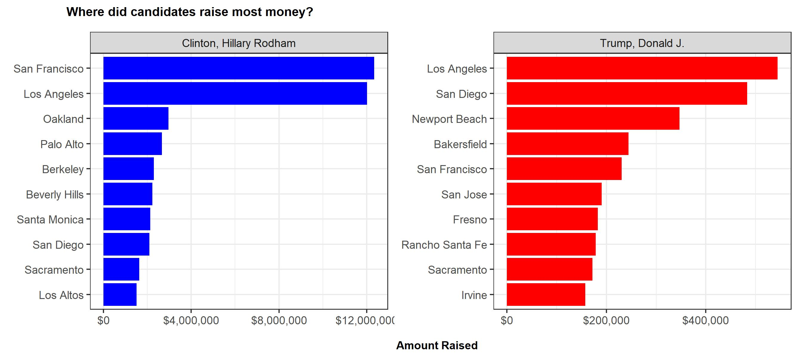
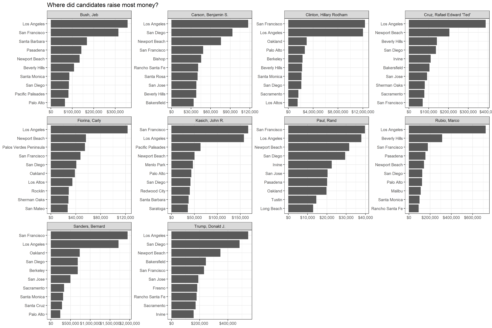

```{r, setup, warning=FALSE, message=FALSE, echo=FALSE}
knitr::opts_chunk$set(
  message = FALSE, 
  warning = FALSE, 
  tidy=FALSE,     # display code as typed
  size="small")   # slightly smaller font for code
options(digits = 3)

# default figure size
knitr::opts_chunk$set(
  fig.width=6.75, 
  fig.height=6.75,
  fig.align = "center"
)
```


```{r load-libraries, warning=FALSE, message=FALSE, echo=FALSE}
library(tidyverse)  # Load ggplot2, dplyr, and all the other tidyverse packages
library(mosaic)
library(ggthemes)
library(lubridate)
library(fivethirtyeight)
library(here)
library(skimr)
library(janitor)
library(vroom)
library(tidyquant)
library(ggrepel)
library(gggenes)
library(scales)
library(devtools)
library(patchwork)
library(tidytext)
```


In this project, we learned how to reproduce the plot that shows the top ten cities in highest amounts raised in political contributions in California during the 2016 US Presidential election.

```{r challenge2, echo=FALSE, out.width="100%"}
knitr::include_graphics("challenge2.png", error = FALSE)
```


```{r, load_CA_data, warnings= FALSE, message=FALSE}
CA_contributors_2016 <- vroom::vroom(here::here("data","CA_contributors_2016.csv"))
zip_code <- vroom::vroom(here::here("data","zip_code_database.csv"))

#Assigning a numerical value to the zip code column of the database
zip_code <- zip_code %>% 
  mutate(zip = as.numeric(zip))

#Merging the two data frames
CA_contributors_2016 <- CA_contributors_2016 %>% 
  inner_join(zip_code, by =  "zip")

#Cleaning the data frames in order to only have the variables we want to analyze
CA_contributors_2016_adapted <- CA_contributors_2016 %>%
  group_by(cand_nm,primary_city) %>% 
  summarise(total_amt = sum(contb_receipt_amt)) %>% 
  select(candidate = cand_nm, city = primary_city, money_raised = total_amt)

# Plotting Hillary Clinton's top 10 contribution cities
clinton <- CA_contributors_2016_adapted %>%
  filter(candidate == "Clinton, Hillary Rodham") %>%
  top_n(10, wt = money_raised) %>% 
  ggplot(aes(x = money_raised, y = reorder(city, money_raised))) + 
  geom_col(fill = "blue") +   
  facet_grid(.~candidate) +
  scale_x_continuous(label=dollar) + 
  theme_update(plot.title = element_text(hjust = 1)) + 
  theme(strip.background = element_rect(fill = "grey"), 
        stip.text = element_text(size = 10, color = "black")) + 
  labs(title = NULL, subtitile = NULL, x= NULL, y=NULL)+
  theme_bw()

# Plotting Donald Trump's top 10 contribution cities
trump <- CA_contributors_2016_adapted %>%
  filter(candidate == "Trump, Donald J.") %>%
  top_n(10, wt = money_raised) %>% 
  ggplot(aes(x = money_raised, y = reorder(city, money_raised))) + 
  geom_col(fill = "red") +   
  facet_grid(.~candidate) +
  scale_x_continuous(label=dollar) + 
  theme_update(plot.title = element_text(hjust = 1)) + 
  theme(strip.background = element_rect(fill = "grey"), 
        stip.text = element_text(size = 10, color = "black")) + 
  labs(title = NULL, subtitile = NULL, x= NULL, y=NULL)+
  theme_bw()

# Combining the 2 graphs together and adding title
clinton_trump_top10 <- clinton + trump +
  plot_annotation(title = "Where did candidates raise most money?", caption = "Amount Raised") 
  theme_update(plot.title = element_text(size = 10, hjust = 0.1, face = "bold"),
               aspect.ratio = 9/4,
               plot.caption = element_text(hjust = 0.55, vjust = 0.5, face = "bold"))

# Save the graph to then display it
ggsave("challenge_accepted.jpg", plot = clinton_trump_top10, width = 9, height = 4)

# Display groph

```

In order to create the same plot for the top 10 candidates instead of just top 2, our codes are as follow:

```{r,top 10 candidates, warnings = FALSE, message = FALSE}

# We need to by candidates and select the top 10
top_10_candidates <- CA_contributors_2016 %>%
  group_by(cand_nm) %>%
  summarize(contb_total_amt=sum(contb_receipt_amt)) %>%
  top_n(10, contb_total_amt) %>%
  arrange(desc(contb_total_amt))

# create a list for top 10 candidates' names
top_10_candidates <- top_10_candidates$cand_nm

# create the plot
plot_top_10 <- CA_contributors_2016_adapted %>%
  group_by(candidate) %>%
  filter(candidate %in% top_10_candidates) %>%
  top_n(10, money_raised) %>%
  ggplot(aes(x=money_raised,y=reorder_within(city,money_raised,candidate)))+
  geom_col()+
  scale_y_reordered()+
  facet_wrap(~candidate,scales='free')+
  labs(title ='Where did candidates raise most money?', x = NULL, y = NULL) +
  scale_x_continuous(label=dollar) + 
  theme_bw()

# save the plot
ggsave("top10plot.png",plot=plot_top_10,width = 15,height = 10)

# show the plot


```


